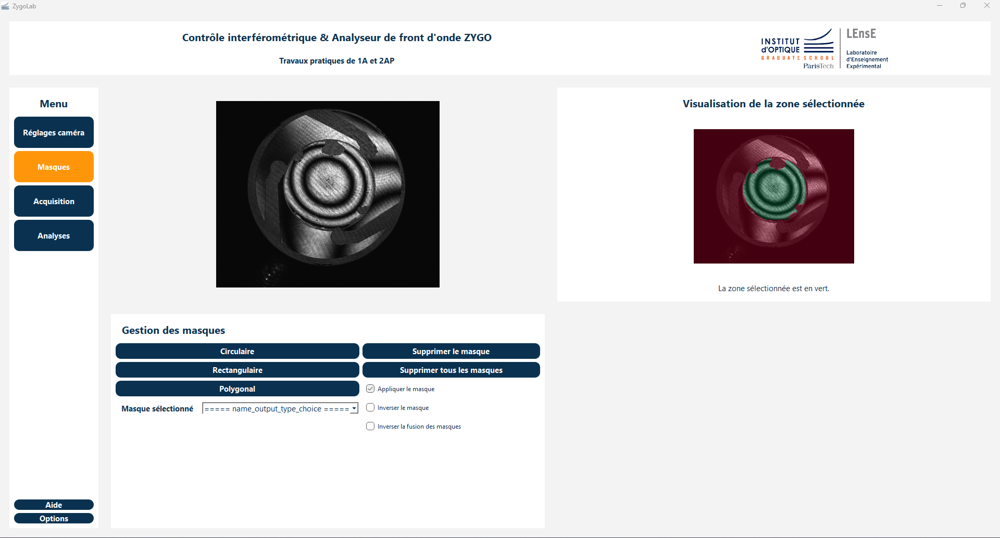
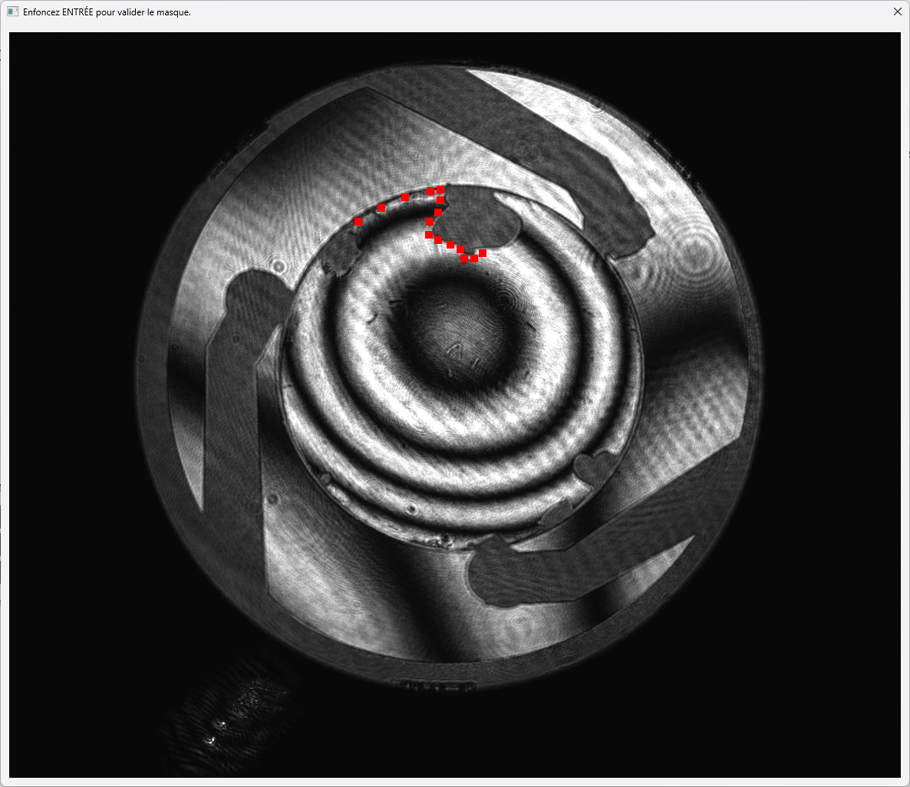
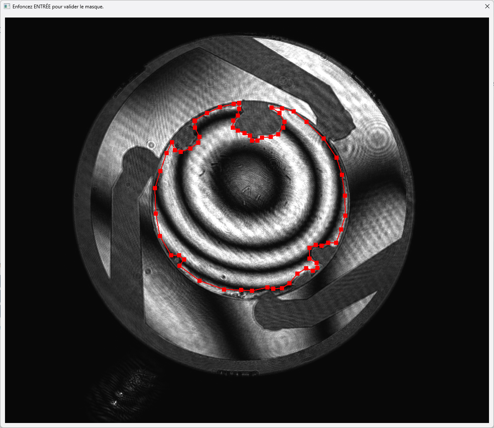
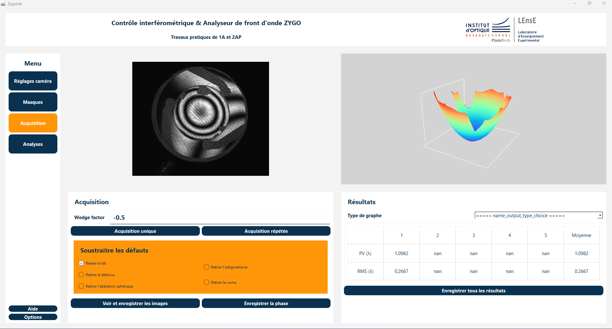

# Notice d'utilisation de l'application ZygoLab

## Table des matières

1. [Pré-requis](#pré-requis)
2. [Accès à l'interface](#accès-à-linterface)
3. [La marche à suivre en TP](#la-marche-à-suivre-en-tp)
4. [Présentation de l'interface](#présentation-de-linterface)

    * [Barre de titre](#barre-de-titre)
    * [Menu principal](#menu-principal)
    * [Paramètres de la caméra](#paramètres-de-la-caméra)
    * [Menu des masques](#menu-des-masques)
    * [Menu d'acquisition](#menu-dacquisition)
    * [Options et paramètres](#options-et-paramètres)
    * [Menu d'analyse](#menu-danalyse)

L'interface utilisateur de l'application **ZygoLab** est conçue pour faciliter l'acquisition et l'analyse des interférogrammes obtenus à l'aide d'un interféromètre Zygo dans le cadre des travaux pratiques de photonique du Laboratoire d'Enseignement Expérimental (*LEnsE*) de l'Institut d'Optique Graduate School (*IOGS*).

Les sujets des TPs en question sont disponibles sur le site du LEnsE :
* En première année : [Contrôles interférométriques](https://lense.institutoptique.fr/tp-controles-interferometriques/)
* En deuxième année : [Aberrations](https://lense.institutoptique.fr/s8-aberrations/)

|              | Date      | Contributeurs                                                       |
| ------------ | --------- | ------------------------------------------------------------------- |
| Création     | Juin 2024 | Julien VILLEMEJANE (PRAG) (<julien.villemejane@institutoptique.fr>) |
| Création     | Juin 2024 | Dorian MENDES (Promo 2026) (<dorian.mendes@institutoptique.fr>)     |
| Modification | à venir.. | à venir ..                                                          |

## Pré-requis
Pour son bon fonctionnement, veillez à ce que la caméra IDS et la cale piézoélectrique soient branchées à l'ordinateur, et que les librairies présentes dans le document [requirements.txt](requirements.txt) soient bien installées.

## Accès à l'interface
Sur le Bureau, cliquez sur ``ZygoLab`` (application ayant comme icône le logo du LEnsE).

## La marche à suivre en TP
Lors d'un TP, voici les étapes essentielles à suivre (veillez à respecter l'ordre de certaines, conformément à ce qui vient d'être dit plus haut):

1. Sélectionnez le menu`Paramètres caméra` pour accéder à la vue en plein écran et le réglage du temps d'exposition.
2. Sélectionnez le menu `Masques` et créez **au moins un masque**.
3. Sélectionnez le menu `Acquisition`, renseignez le *wedge factor* et effectuez une acquisition (simple ou répétée). Vous pouvez **ensuite** supprimer une ou plusieurs aberrations. Vous pouvez enregistrer vos résultats.
    > **Attention:** les cases à cocher peuvent mettre du temps à s'activer *(car cela déclenche le calcul des coefficients de Zernike)*: cliquez une seule fois et attendez.
* *Fin du TP de 1A*
4. Sélectionnez le menu `Analyses`. Une seconde fenêtre s'ouvre.
    > **Attention:** cette fenêtre met du temps à s'ouvrir *(car cela déclenche le calcul des coefficients de Zernike)*: cliquez une seule fois et attendez.
5. Renseignez le nombre d'ouverture de votre système en haut à gauche.
6. Accédez aux différents résultats via le menu principal à gauche.
    > **Attention:** l'affichage d'un menu prend du temps *(car cela déclenche le calcul des PSF et MTF dans tous les cas en amont)*: cliquez une seule fois et attendez.
* *Fin du TP de 2A*

## Présentation de l'interface
L'interface est composée de plusieurs widgets et éléments interactifs organisés de manière intuitive. Voici une description des principales sections de l'interface :

### Barre de titre
La barre de titre située en haut de l'interface affiche le titre de l'application et peut contenir des informations supplémentaires sur l'état de l'application.

### Menu principal
Le menu principal, situé sur la gauche, permet d'accéder aux différentes fonctionnalités de l'application :

* **Paramètres de la caméra** : Permet de configurer les paramètres de la caméra.
* **Masques** : Gère la sélection et l'application des masques.
* **Acquisition** : Pour démarrer et gérer les acquisitions. C'est aussi dans ce menu que les résultats principaux s'affichent.
* **Analyse** : Pour visualiser et analyser les résultats dans une fenêtre secondaire.
* **Aide** : Permet d'accéder facilement à cette notice depuis l'interface.
* **Options** : Options générales et paramètres de l'application.

### Paramètres de la caméra
Cette vue permet de configurer les paramètres de la caméra tels que le temps d'exposition, le niveau de noir, etc. Les utilisateurs peuvent ajuster ces paramètres pour optimiser l'acquisition des images en fonction des besoins de leur expérience. Elle permet aussi d'afficher l'image de la caméra en plein écran.

Cette vue est composée :
* d'une visualisation en temps réel de l'image obtenue par la caméra du *Zygo*,
* d'un curseur réglant le temps d'exposition de la caméra,
* d'un curseur réglant le niveau de noir de la caméra,
* d'un bouton permettant d'afficher l'image en plein écran,
* et d'un bouton permettant de réinitialiser les paramètres de la caméra.

Dans le cas où l'image est affichée en plein écran dans une fenêtre secondaire, l'image dans la fenêtre principale se fige mais les curseurs restent actifs.

### Menu des masques
Le menu des masques permet aux utilisateurs de sélectionner et d'appliquer différents masques sur les images capturées. Les masques peuvent être utilisés pour isoler certaines zones d'intérêt et améliorer l'analyse.

> **Note** : Il est nécessaire de sélectionner au moins un masque pour ensuite faire une acquisition. (Fermer la fenêtre de sélection de masque par la croix et non par `ENTER` permet de sélectionner toute l'image rapidement).

L'utilisateur a le choix entre trois types de masques :
* un masque circulaire (la sélection se fait par 3 points appartenant au cercle),
* un masque rectangulaire (la sélection se fait par 2 points opposés du rectangle),
* un masque polygonal (la sélection se fait par N points appartenant au polygone).

Lorsqu'un type de masque est sélectionné, une fenêtre secondaire s'ouvre. Un point est sélectionné par un clic gauche. Pour les masques circulaires et rectangulaires, le masque se forme une fois le 2e ou 3e point sélectionné. Pour un masque polygonal, il faut cliquer sur le premier point sélectionné pour fermer le polygone.

Dans tous les cas, il est nécessaire de fermer la fenêtre en appuyant sur la touche `ENTER` afin de valider la création du masque. Sinon, **le masque ne sera pas créé**.

L'utilisateur peut aussi choisir un masque via la liste déroulante (la numérotation correspond à l'ordre chronologique de création). Il peut alors choisir de :
* supprimer ce masque,
* appliquer ce masque ou non,
* et/ou inverser ce masque ou non.

L'utilisateur peut aussi choisir de supprimer tous les masques.

Dans le cas d'une suppression d'un ou de tous les masques, une fenêtre de dialogue s'ouvre demandant la confirmation. Si la case `Yes` est cochée, alors le masque est supprimé et la numérotation des masques est actualisée. Si la case `No` est cochée ou si la fenêtre est fermée par la croix, alors le masque n'est pas supprimé mais simplement désactivé.

> **Astuce** : ...

### Menu d'acquisition
La vue d'acquisition permet de démarrer et de gérer les sessions d'acquisition des interférogrammes. Elle offre des options pour configurer les paramètres de l'acquisition et pour lancer les processus de capture d'images. C'est dans cette vue que l'on retrouve aussi les principaux résultats une fois l'acquisition faite. L'utilisateur peut aussi choisir de supprimer certaines aberrations avant l'étape d'analyse (voir le [menu Analyses](#menu-danalyse)).

> **Note** : Si l'utilisateur souhaite supprimer une ou des aberrations, il doit le faire **après** l'acquisition. Sinon, un message d'erreur apparaît et l'invite à effectuer une acquisition avant.

Pour lancer une acquisition, deux manières :
* faire une acquisition simple,
* ou faire une acquisition répétée. Dans ce cas, la mesure est faite 5 fois et la dernière est affichée.

L'utilisateur doit renseigner le *wedge factor* (facteur d'interfrange) afin que les valeurs calculées correspondent effectivement à la situation physique. Le *wedge factor* doit être donné avec son signe. Le *wedge factor* peut être renseigné avant ou après l'acquisition (valeur par défaut : +1). Dans ce cas, l'affichage est actualisé avec cette nouvelle valeur.

Lors de l'acquisition, cinq images chacune déphasée de 90° sont prises, puis l'algorithme de Hariharan ([voir l'article](www.google.fr)) et un algorithme de déroulement de la phase sont appliqués afin d'obtenir la surface.

Une fois l'acquisition faite, l'utilisateur a trois choix pour afficher la surface obtenue :
* une visualisation 3D,
* une visualisation 2D,
* une visualisation par lignes de niveaux.

Ensuite, l'utilisateur peut enregistrer :
* les cinq images de l'algorithme de Hariharan,
* la phase (c'est-à-dire la surface calculée),
* et/ou les différentes valeurs calculées.

Les images sont enregistrées dans un dossier spécifié par l'utilisateur via une boîte de dialogue au format `.png`.

Les autres résultats sont enregistrés dans un fichier `.txt`.

### Options et paramètres
Le menu des options contient des paramètres généraux pour l'application, comme les préférences linguistiques, les options de calibrage du piézo, et d'autres configurations avancées.

### Menu d'analyse
La fenêtre Analyse se compose de trois zones distinctes:
* une ligne de titre en haut,
* un menu à gauche,
* et une zone variable selon les menus sélectionnés.

L'utilisateur peut sélectionner trois vues:
* **Zernike/Seidel:** Permet de visualiser les coefficients de Zernike et de Seidel du système étudié.
* **PSF:** Permet de visualiser la PSF en niveau de gris (affichage logarithmique), des coupes de la PSF et la PSF dans le cas d'une défocalisation.
* **MTF:** Permet de visualiser la MTF en 3D (affichage logarithmique), des coupes de la MTF et la MTF dans le cas d'une défocalisation.
