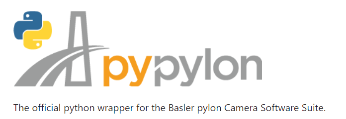

Basler Camera Sensors
#####################

Requirements
************

Pylon Viewer software and drivers
=================================

Industrial camera sensors from the **Basler** family require the installation of the *Basler drivers*, including in their *pylon Viewer* software. More information on the  `Basler website <https://www.baslerweb.com/en/>`_.

.. figure:: ../_static/images/basler_pylon_software_download.png
  :scale: 60%
  :align: center
  
  From Basler Website.

Pypylon wrapper
===============

An official python wrapper for the Basler pylon Camera Software Suite is called **pypylon**. You can get more information about pypylon on their GitHub repository : `Pypylon GitHub repository <https://github.com/basler/pypylon>`_.

  
  From Pypylon Website.
  
You can install this extension in a shell by the command : :code:`pip install pypylon`

.. warning:: 
	
	A complete version of Python (higher than 3.9) must be already installed on your computer. To check the version number, you can use the next command in a shell : :code:`python --version`

Installation test
=================

**Before any software development**, you need to test if the hardware is operational and if the driver of the USB camera is correctly installed.

Pylon Software from Basler
--------------------------

First of all, you should try to obtain images **from the software** provided by *Basler*. 

The software is called **pylon Viewer**. Connect your USB camera (or verify that the USB cable is connected) to your computer and start the **pylon Viewer** software.

.. figure:: ../_static/images/basler_pylon_software_icone.png
  :align: center

STEPS ????

TO DO

Pypylon extension
-----------------

To check that the **pypylon** extension is also correctly installed and that the pylon driver is recognized by the Python API, you can download the next Python test file : `pypylon_main_test.py <https://github.com/IOGS-LEnsE/camera-gui/blob/main/progs/Basler/pypylon_main_test.py>`_. This file is provided by the development team of the **pypylon** wrapper.

EXAMPLE ???

If the execution of this script proceeds without error, it means that everything is ready to use the *Basler* devices in a Python script or interface.

LEnsE development
*****************

To facilitate the integration of the pypylon API in the different projects, we developped : 

* a *driver* based on the *pypylon* API,
* a *widget* based on *PyQt6*.

Basler Driver
=============

This driver is based on the `Pypylon Wrapper <https://github.com/basler/pypylon>`_.

It is composed in two main files :

* `camera_basler.py <https://github.com/IOGS-LEnsE/camera-gui/blob/main/progs/Basler/camera_basler.py>`_ containing
* `camera_list.py <https://github.com/IOGS-LEnsE/camera-gui/blob/main/progs/Basler/camera_list.py>`_

>>> my_cam = CameraBasler(cam_dev)

Basler Widget
=============

API reference
=============

CameraBasler class
------------------

.. autoclass:: camera_basler.CameraBasler
   :members:

CameraList class
----------------

.. autoclass:: camera_list.CameraList
   :members:

